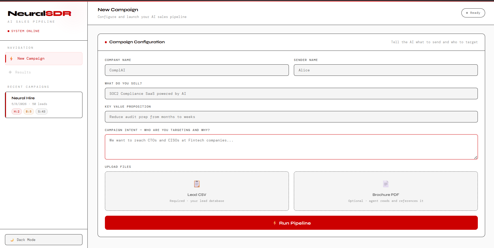
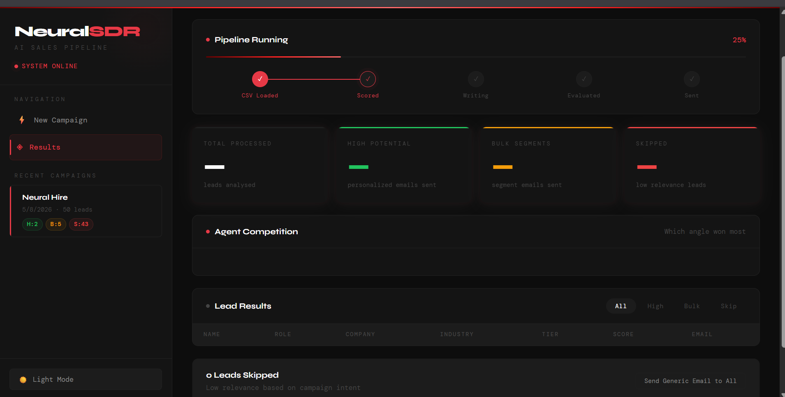
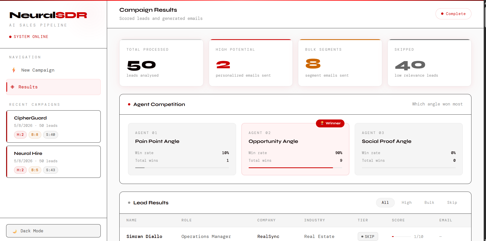
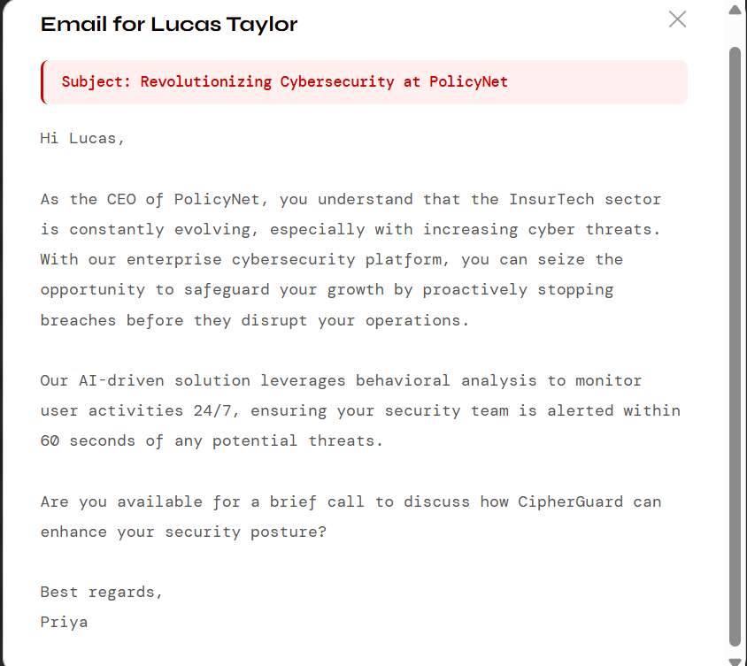
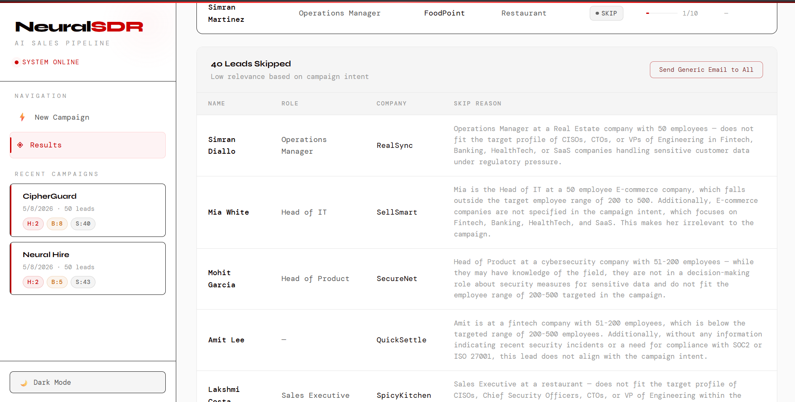

# NeuralSDR — AI Powered Sales Pipeline

An autonomous multi-agent AI system that ingests a lead database, scores each lead based on campaign intent, generates personalized cold emails using competing LLMs, and delivers them automatically via SendGrid.

---

## Screenshots

### Campaign Setup


### Pipeline Running


### Results Dashboard


### Email Preview


### Skip Reasons


---

## What it does

- Upload a CSV of leads and describe your campaign intent in plain English
- A **scoring agent** reads each lead's role, industry and company size and classifies them as HIGH, BULK or SKIP based purely on your intent — not hardcoded rules
- **3 competing email agents** write emails from different strategic angles (Pain Point, Opportunity, Social Proof) in parallel using asyncio
- An **independent evaluator agent** picks the best email — no self-scoring bias
- Best emails are automatically sent via SendGrid
- Full results dashboard shows scoring breakdown, which angle won, and email previews
- Optional PDF upload — agent reads your brochure and references specific stats in emails
- Recent campaigns saved in localStorage — results persist across sessions

---

## Architecture

```
CSV Upload + Campaign Intent
        │
        ▼
   Guardrail Agent
   (blocks harmful campaigns)
        │
        ▼
   Scoring Agent (GPT-4o-mini)
   reads role + industry + size
   against campaign intent
        │
        ├── HIGH (7-10)     → per-person personalized email
        ├── BULK (4-6)      → per-segment email
        └── SKIP (1-3)      → flagged, optional send
              │
              ▼
     3 Email Agents run in parallel (asyncio.gather)
     Agent 1: Pain Point Angle
     Agent 2: Opportunity Angle
     Agent 3: Social Proof Angle
              │
              ▼
     Independent Evaluator Agent
     picks best email per lead
              │
              ▼
     SendGrid delivers emails
              │
              ▼
     Dashboard shows full results
```

---

## Tech Stack

| Layer | Technology |
|-------|-----------|
| Agent Framework | OpenAI Agents SDK |
| LLM | GPT-4o-mini |
| Async Execution | Python asyncio |
| Structured Outputs | Pydantic |
| Backend | FastAPI + Uvicorn |
| Email Delivery | SendGrid |
| PDF Parsing | pdfplumber |
| Frontend | HTML/CSS/JS |
| Data | Pandas |

---

## Key Concepts Demonstrated

- **Multi-agent orchestration** — scoring agent, 3 writing agents, evaluator agent working in sequence
- **Parallel async execution** — all 3 LLMs run simultaneously via asyncio.gather
- **Dynamic intent-based scoring** — same role can be HIGH for one campaign and SKIP for another
- **Input guardrails** — pipeline level safety check before processing begins
- **Structured outputs** — Pydantic enforced response schemas throughout
- **Agent handoffs** — pipeline transitions between agents automatically
- **Human-in-the-loop optional** — skip leads shown with reasons, user can choose to send generic email

---

## Setup

### 1. Clone the repo

```bash
git clone https://github.com/yourusername/neuralsdr.git
cd neuralsdr
```

### 2. Install dependencies

```bash
pip install -r requirements.txt
```

### 3. Configure environment

```bash
cp .env.example .env
```

Fill in your API keys in `.env`:

```env
OPENAI_API_KEY=your_openai_key
SENDGRID_API_KEY=your_sendgrid_key
SENDER_EMAIL=your_verified_sender@gmail.com
```

### 4. Run

```bash
python app.py
```

Open `http://localhost:8000` in your browser.

---

## How to Use

1. Fill in your campaign details — company, product, value prop, intent
2. Upload your leads CSV (see `data/leads_demo_300.csv` for format)
3. Optionally upload a product brochure PDF — agent will reference it
4. Click **Run Pipeline**
5. View results — scored leads, winning angle, email previews
6. Emails are automatically sent to HIGH and BULK leads

---

## CSV Format

Your leads CSV should have these columns:

```
First Name, Last Name, Work Email, Job Title, Company,
Industry, Employee Range, Country, Lead Source,
Company Website, LinkedIn URL
```

Sample data is included in `data/leads_dev_50.csv` (dev) and `data/leads_demo_300.csv` (demo).

---

## Project Structure

```
neuralsdr/
├── app.py                  # Entry point
├── requirements.txt
├── .env.example
├── core/
│   ├── scoring_agent.py    # Lead scoring logic
│   ├── email_agents.py     # 3 LLMs + evaluator
│   └── guardrails.py       # Input safety check
├── pipeline/
│   └── runner.py           # Full pipeline orchestration
├── api/
│   └── main.py             # FastAPI endpoints
├── frontend/
│   └── index.html          # Dashboard UI
└── data/
    ├── leads_dev_50.csv
    └── leads_demo_300.csv
```

---

## Built With

- [OpenAI Agents SDK](https://github.com/openai/openai-agents-python)
- [FastAPI](https://fastapi.tiangolo.com)
- [SendGrid](https://sendgrid.com)

---

